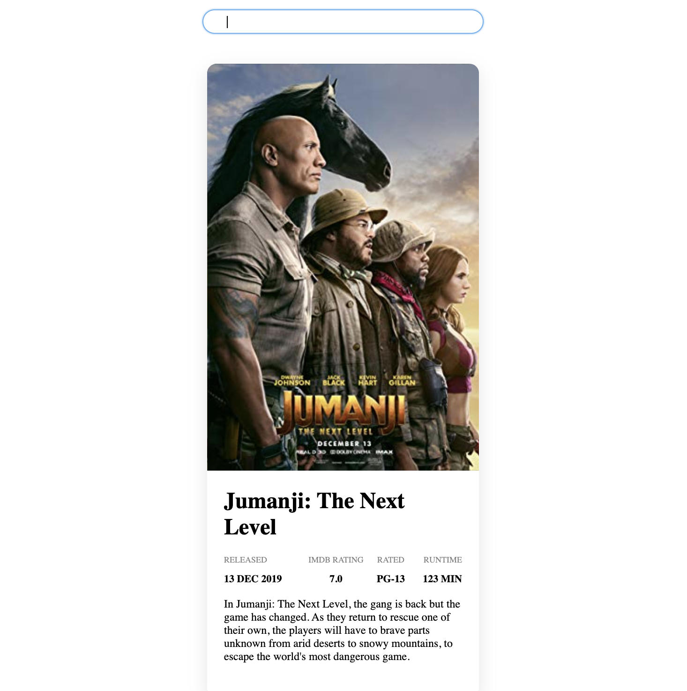
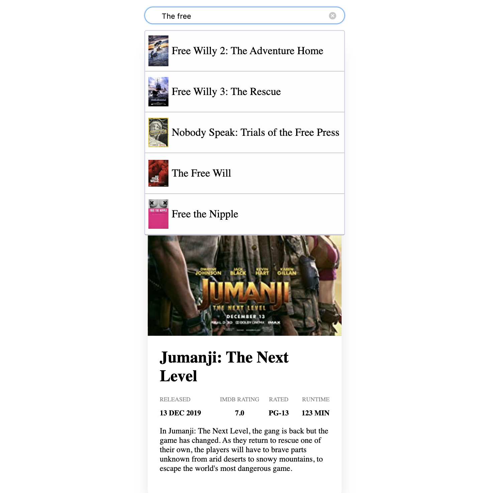
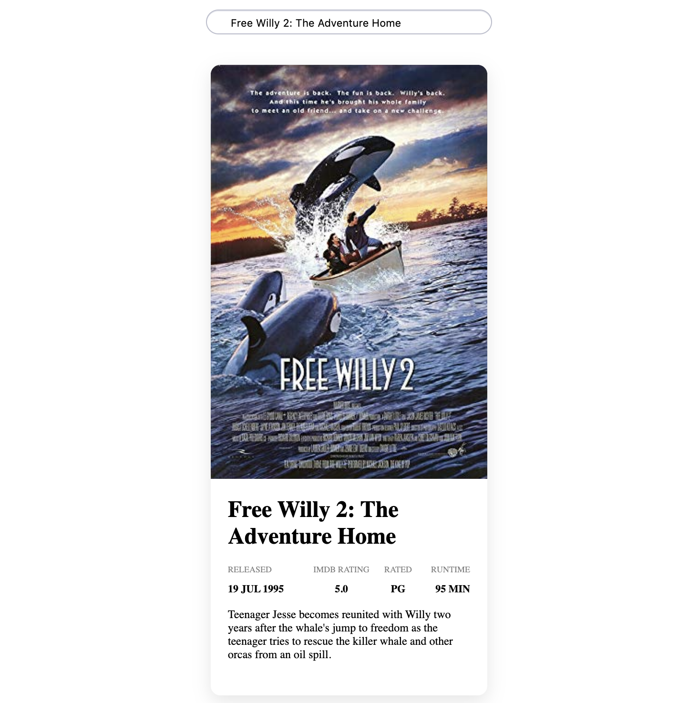
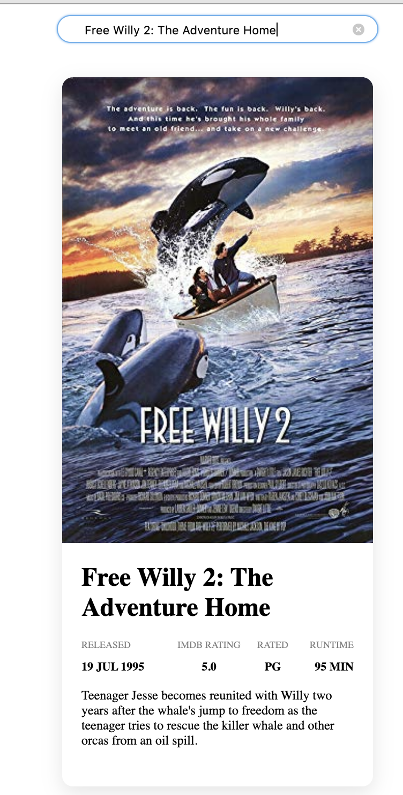

# Simple Movie Search App with React

## React
    ** folder: `React` **
    
    *To set up React App:*
        1. Clone the repository and cd into the React directory. 
        2. Then execute `npm install` to install the dependencies.
        3. `npm run dev` to start server. 
        4. Navigate to Local URL:PORT ** or check out screenshots of working demo version of App.**

        
       
        

        

        

## Django
    ** folder: `Django` **
